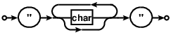
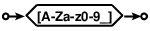
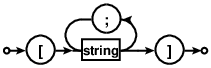

[Syntax diagram][] generator from [SQLite][] with a few modifications.

## Syntax description from arbitrary file

Path to a syntax description file should be specified in the command
line.

Original generator reads syntax diagram description from
`bubble-generator-data.tcl` file.

## Quote and brace tokens

Allow single quote/brace tokens in the description:

    string {
        line "\"" {toploop {optx char}} "\""
    }

Original generator fails to process `"`, `{` and `}` tokens.

## Bracket expression tokens

Recognize bracket expression tokens and render them as a hexagon
figure:

    char {
        line [A-Za-z0-9_]
    }

To have a `[` string token in the diagram escape it with `/`:

    list {
        line /[ {toploop string ;} ]
    }

[Syntax diagram]: https://en.wikipedia.org/wiki/Syntax_diagram
[SQLite]: http://www.sqlite.org/docsrc/dir?ci=3d991d2d4e9a4901&name=art/syntax
